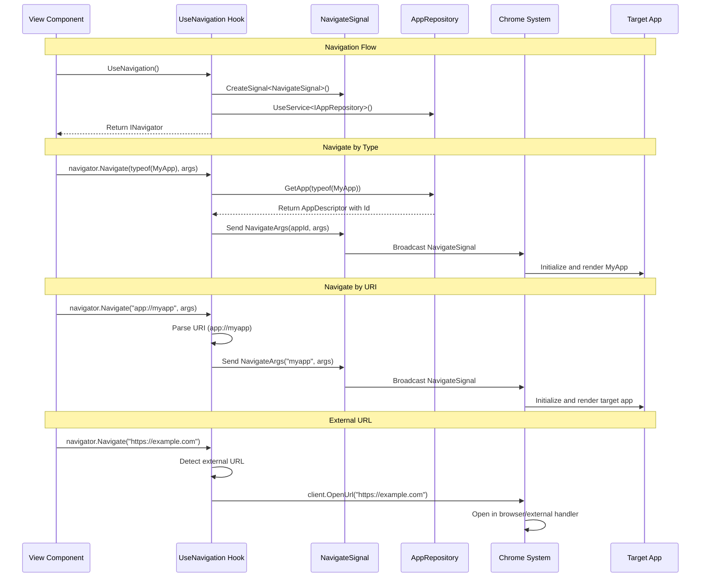

---
searchHints:
  - navigation
  - routing
  - usenavigation
  - navigate
  - apps
  - deeplink
  - urls
  - chrome
---

# Navigation

<Ingress>
The UseNavigation hook provides a powerful way to navigate between apps and external URLs in Ivy applications, enabling seamless user experiences and deep linking capabilities.
</Ingress>

## Overview

Navigation in Ivy is handled through the `UseNavigation()` hook, which returns an `INavigator` interface. This hook enables:

- **App-to-App Navigation** - Navigate between different Ivy apps within your application
- **External URL Navigation** - Open external websites and resources
- **Deep Linking** - Navigate to specific apps with parameters and arguments
- **Type-Safe Navigation** - Navigate using strongly-typed app classes

The navigation system is built on top of Ivy's signal system and integrates seamlessly with the Chrome framework for managing app lifecycle and routing.

## How UseNavigation Works



## Basic Usage

### Getting the Navigator

```csharp
[App(icon: Icons.Navigation)]
public class MyNavigationApp : ViewBase
{
    public override object? Build()
    {
        // Get the navigator instance
        var navigator = this.UseNavigation();
        
        return new Button("Navigate to Another App")
            .HandleClick(() => navigator.Navigate(typeof(AnotherApp)));
    }
}
```

### Navigation Methods

The `INavigator` interface provides two main navigation methods:

```csharp
public interface INavigator
{
    // Navigate using app type (type-safe)
    void Navigate(Type type, object? appArgs = null);
    
    // Navigate using URI string (flexible)
    void Navigate(string uri, object? appArgs = null);
}
```

## Navigation Patterns

### 1. Type-Safe Navigation

Navigate to apps using their class types for compile-time safety:

```csharp
public class DashboardApp : ViewBase
{
    public override object? Build()
    {
        var navigator = this.UseNavigation();
        
        return Layout.Vertical(
            new Button("Go to User Profile")
                .HandleClick(() => navigator.Navigate(typeof(UserProfileApp))),
                
            new Button("Open Settings")
                .HandleClick(() => navigator.Navigate(typeof(SettingsApp))),
                
            new Button("View Reports")
                .HandleClick(() => navigator.Navigate(typeof(ReportsApp)))
        );
    }
}
```

### 2. Navigation with Arguments

Pass data to target apps using strongly-typed arguments:

```csharp
public record UserProfileArgs(int UserId, string Tab = "overview");

public class UserListApp : ViewBase
{
    public override object? Build()
    {
        var navigator = this.UseNavigation();
        var users = UseState(GetUsers());
        
        return new Table<User>(users.Value)
            .Column("Name", u => u.Name)
            .Column("Email", u => u.Email)
            .Column("Actions", u => 
                new Button("View Profile")
                    .HandleClick(() => navigator.Navigate(
                        typeof(UserProfileApp), 
                        new UserProfileArgs(u.Id, "details")
                    ))
            );
    }
}

[App(icon: Icons.User)]
public class UserProfileApp : ViewBase
{
    public override object? Build()
    {
        var args = UseArgs<UserProfileArgs>();
        var navigator = this.UseNavigation();
        
        if (args == null)
        {
            return Text.Block("No user specified");
        }
        
        return Layout.Vertical(
            new Button("← Back to Users")
                .HandleClick(() => navigator.Navigate(typeof(UserListApp))),
                
            Text.Heading($"User Profile: {args.UserId}"),
            Text.Block($"Active Tab: {args.Tab}")
        );
    }
}
```

### 3. URI-Based Navigation

Use URI strings for dynamic navigation scenarios:

```csharp
public class AppLauncherView : ViewBase
{
    public override object? Build()
    {
        var navigator = this.UseNavigation();
        var selectedApp = UseState("");
        
        var availableApps = new[]
        {
            ("Dashboard", "app://dashboard"),
            ("Users", "app://users"),
            ("Settings", "app://settings"),
            ("Reports", "app://reports")
        };
        
        return Layout.Vertical(
            new Select("Choose App", selectedApp.Value, 
                availableApps.Select(a => a.Item1).ToArray(),
                value => selectedApp.Set(availableApps.First(a => a.Item1 == value).Item2)
            ),
            
            new Button("Launch App")
                .Disabled(string.IsNullOrEmpty(selectedApp.Value))
                .HandleClick(() => navigator.Navigate(selectedApp.Value))
        );
    }
}
```

### 4. External URL Navigation

Open external websites and resources:

```csharp
public class ResourcesApp : ViewBase
{
    public override object? Build()
    {
        var navigator = this.UseNavigation();
        
        return Layout.Vertical(
            Text.Heading("External Resources"),
            
            new Button("Open Documentation")
                .HandleClick(() => navigator.Navigate("https://docs.ivy-framework.com")),
                
            new Button("View GitHub Repository")
                .HandleClick(() => navigator.Navigate("https://github.com/ivy-framework/ivy")),
                
            new Button("Community Forum")
                .HandleClick(() => navigator.Navigate("https://community.ivy-framework.com"))
        );
    }
}
```

## Advanced Navigation Patterns

### 1. Conditional Navigation

Navigate based on user permissions or application state:

```csharp
public class SecureNavigationApp : ViewBase
{
    public override object? Build()
    {
        var navigator = this.UseNavigation();
        var user = UseService<IUserService>().GetCurrentUser();
        
        var handleAdminNavigation = UseCallback(() =>
        {
            if (user.HasRole("Admin"))
            {
                navigator.Navigate(typeof(AdminPanelApp));
            }
            else
            {
                navigator.Navigate(typeof(UnauthorizedApp));
            }
        }, user);
        
        return Layout.Vertical(
            new Button("Dashboard")
                .HandleClick(() => navigator.Navigate(typeof(DashboardApp))),
                
            new Button("Admin Panel")
                .Disabled(!user.HasRole("Admin"))
                .HandleClick(handleAdminNavigation),
                
            new Button("Profile")
                .HandleClick(() => navigator.Navigate(
                    typeof(UserProfileApp), 
                    new UserProfileArgs(user.Id)
                ))
        );
    }
}
```

### 2. Navigation with State Preservation

Preserve navigation state for back/forward functionality:

```csharp
public class NavigationHistoryApp : ViewBase
{
    public override object? Build()
    {
        var navigator = this.UseNavigation();
        var navigationHistory = UseState(new Stack<string>());
        
        var navigateWithHistory = UseCallback((string appUri) =>
        {
            navigationHistory.Set(stack =>
            {
                var newStack = new Stack<string>(stack);
                newStack.Push(appUri);
                return newStack;
            });
            navigator.Navigate(appUri);
        }, navigationHistory);
        
        var goBack = UseCallback(() =>
        {
            if (navigationHistory.Value.Count > 0)
            {
                navigationHistory.Set(stack =>
                {
                    var newStack = new Stack<string>(stack);
                    if (newStack.Count > 0)
                    {
                        var previousApp = newStack.Pop();
                        navigator.Navigate(previousApp);
                    }
                    return newStack;
                });
            }
        }, navigationHistory);
        
        return Layout.Vertical(
            new Button("← Back")
                .Disabled(navigationHistory.Value.Count == 0)
                .HandleClick(goBack),
                
            Layout.Horizontal(
                new Button("Go to Users")
                    .HandleClick(() => navigateWithHistory("app://users")),
                    
                new Button("Go to Settings")
                    .HandleClick(() => navigateWithHistory("app://settings"))
            )
        );
    }
}
```

### 3. Dynamic App Loading

Navigate to apps based on runtime configuration:

```csharp
public class DynamicNavigationApp : ViewBase
{
    public override object? Build()
    {
        var navigator = this.UseNavigation();
        var appRepository = UseService<IAppRepository>();
        var availableApps = UseState<List<AppDescriptor>>(new());
        
        UseEffect(async () =>
        {
            var apps = await appRepository.GetAvailableAppsAsync();
            availableApps.Set(apps.Where(a => a.IsVisible).ToList());
        });
        
        return Layout.Vertical(
            Text.Heading("Available Applications"),
            
            Layout.Vertical(
                availableApps.Value.Select(app =>
                    new Card(
                        Layout.Horizontal(
                            new Icon(app.Icon),
                            Layout.Vertical(
                                Text.Heading(app.DisplayName),
                                Text.Block(app.Description)
                            ),
                            new Button("Open")
                                .HandleClick(() => navigator.Navigate($"app://{app.Id}"))
                        )
                    ).Key(app.Id)
                )
            )
        );
    }
}
```

## Navigation Helpers

### Creating Reusable Navigation Helpers

```csharp
public static class NavigationHelpers
{
    public static Action<string> UseLinks(this IView view)
    {
        var navigator = view.UseNavigation();
        return uri => navigator.Navigate(uri);
    }
    
    public static Action<Type, object?> UseAppNavigation(this IView view)
    {
        var navigator = view.UseNavigation();
        return (type, args) => navigator.Navigate(type, args);
    }
    
    public static Action UseBackNavigation(this IView view, string defaultApp = "app://dashboard")
    {
        var navigator = view.UseNavigation();
        return () => navigator.Navigate(defaultApp);
    }
}

// Usage in components
public class MyComponentWithHelpers : ViewBase
{
    public override object? Build()
    {
        var navigateToLink = this.UseLinks();
        var navigateToApp = this.UseAppNavigation();
        var goBack = this.UseBackNavigation();
        
        return Layout.Vertical(
            new Button("External Link")
                .HandleClick(() => navigateToLink("https://example.com")),
                
            new Button("Internal App")
                .HandleClick(() => navigateToApp(typeof(SettingsApp), null)),
                
            new Button("Go Back")
                .HandleClick(goBack)
        );
    }
}
```

## Integration with Chrome Settings

Navigation behavior can be configured through Chrome settings:

```csharp
public class Program
{
    public static void Main(string[] args)
    {
        IvyApp.Run(args, app =>
        {
            app.UseChrome(ChromeSettings.Default()
                .UseTabs(preventDuplicates: true) // Prevent duplicate tabs
                .DefaultApp<DashboardApp>()       // Set default app
            );
        });
    }
}
```

### Navigation Modes

- **Tabs Mode**: Each navigation creates a new tab (default)
- **Pages Mode**: Navigation replaces the current view
- **Prevent Duplicates**: Avoid opening multiple tabs for the same app

## Best Practices

### 1. Use Type-Safe Navigation When Possible

```csharp
// Preferred: Type-safe navigation
navigator.Navigate(typeof(UserProfileApp), new UserProfileArgs(userId));

// Avoid: String-based navigation when type is known
navigator.Navigate($"app://user-profile?userId={userId}");
```

### 2. Handle Navigation Errors Gracefully

```csharp
public class SafeNavigationApp : ViewBase
{
    public override object? Build()
    {
        var navigator = this.UseNavigation();
        var error = UseState<string?>(null);
        
        var safeNavigate = UseCallback((Type appType) =>
        {
            try
            {
                navigator.Navigate(appType);
                error.Set(null);
            }
            catch (InvalidOperationException ex)
            {
                error.Set($"Navigation failed: {ex.Message}");
            }
        }, error);
        
        return Layout.Vertical(
            error.Value != null ? new Alert(error.Value, AlertType.Error) : null,
            
            new Button("Navigate Safely")
                .HandleClick(() => safeNavigate(typeof(SomeApp)))
        );
    }
}
```

### 3. Use Memoized Callbacks for Navigation

```csharp
public class OptimizedNavigationApp : ViewBase
{
    public override object? Build()
    {
        var navigator = this.UseNavigation();
        var selectedUserId = UseState<int?>(null);
        
        // Memoize navigation callback to prevent unnecessary re-renders
        var navigateToUser = UseCallback((int userId) =>
        {
            navigator.Navigate(typeof(UserProfileApp), new UserProfileArgs(userId));
        }, navigator);
        
        return new UserList(onUserSelected: navigateToUser);
    }
}
```

### 4. Provide Clear Navigation Feedback

```csharp
public class NavigationWithFeedbackApp : ViewBase
{
    public override object? Build()
    {
        var navigator = this.UseNavigation();
        var isNavigating = UseState(false);
        
        var handleNavigation = UseCallback(async (Type appType) =>
        {
            isNavigating.Set(true);
            try
            {
                await Task.Delay(100); // Simulate navigation delay
                navigator.Navigate(appType);
            }
            finally
            {
                isNavigating.Set(false);
            }
        }, isNavigating);
        
        return new Button("Navigate")
            .Loading(isNavigating.Value)
            .HandleClick(() => handleNavigation(typeof(TargetApp)));
    }
}
```

## Common Patterns and Use Cases

### 1. Master-Detail Navigation

```csharp
public class MasterDetailApp : ViewBase
{
    public override object? Build()
    {
        var navigator = this.UseNavigation();
        var items = UseState(GetItems());
        
        return new Table<Item>(items.Value)
            .Column("Name", i => i.Name)
            .Column("Description", i => i.Description)
            .OnRowClick(item => 
                navigator.Navigate(typeof(ItemDetailApp), new ItemDetailArgs(item.Id))
            );
    }
}
```

### 2. Wizard Navigation

```csharp
public class WizardNavigationApp : ViewBase
{
    public override object? Build()
    {
        var navigator = this.UseNavigation();
        var currentStep = UseArgs<WizardArgs>()?.Step ?? 1;
        var wizardData = UseState(new WizardData());
        
        var nextStep = UseCallback(() =>
        {
            navigator.Navigate(typeof(WizardNavigationApp), 
                new WizardArgs(currentStep + 1, wizardData.Value));
        }, currentStep, wizardData);
        
        var previousStep = UseCallback(() =>
        {
            if (currentStep > 1)
            {
                navigator.Navigate(typeof(WizardNavigationApp), 
                    new WizardArgs(currentStep - 1, wizardData.Value));
            }
        }, currentStep, wizardData);
        
        return Layout.Vertical(
            Text.Heading($"Step {currentStep} of 3"),
            RenderCurrentStep(currentStep, wizardData),
            
            Layout.Horizontal(
                new Button("Previous")
                    .Disabled(currentStep <= 1)
                    .HandleClick(previousStep),
                    
                new Button(currentStep < 3 ? "Next" : "Finish")
                    .HandleClick(nextStep)
            )
        );
    }
}
```

### 3. Context-Aware Navigation

```csharp
public class ContextAwareNavigationApp : ViewBase
{
    public override object? Build()
    {
        var navigator = this.UseNavigation();
        var context = UseService<IApplicationContext>();
        
        var navigateBasedOnContext = UseCallback(() =>
        {
            switch (context.UserRole)
            {
                case "Admin":
                    navigator.Navigate(typeof(AdminDashboardApp));
                    break;
                case "Manager":
                    navigator.Navigate(typeof(ManagerDashboardApp));
                    break;
                default:
                    navigator.Navigate(typeof(UserDashboardApp));
                    break;
            }
        }, context);
        
        return new Button("Go to My Dashboard")
            .HandleClick(navigateBasedOnContext);
    }
}
```

## Troubleshooting

### Common Issues and Solutions

#### 1. App Not Found Error

**Problem**: `InvalidOperationException: App 'MyApp' not found`

**Solution**: Ensure the target app is registered in the app repository

```csharp
// Make sure your app is decorated with [App] attribute
[App(icon: Icons.Dashboard)]
public class MyApp : ViewBase
{
    // App implementation
}
```

#### 2. Navigation Arguments Not Received

**Problem**: `UseArgs<T>()` returns null in target app

**Solution**: Ensure argument types match exactly

```csharp
// Source app
navigator.Navigate(typeof(TargetApp), new MyArgs("value"));

// Target app - ensure exact type match
var args = UseArgs<MyArgs>(); // Must be same type as passed
```

#### 3. External URLs Not Opening

**Problem**: External URLs don't open in browser

**Solution**: Ensure proper URL format with protocol

```csharp
// Correct: Include protocol
navigator.Navigate("https://example.com");

// Incorrect: Missing protocol
navigator.Navigate("example.com"); // Will be treated as app URI
```

## Performance Considerations

- **Memoize Navigation Callbacks**: Use `UseCallback` for navigation handlers to prevent unnecessary re-renders
- **Lazy App Loading**: Apps are loaded on-demand when navigated to
- **State Cleanup**: Navigation automatically handles cleanup of previous app state
- **Memory Management**: The Chrome system manages app lifecycle and memory usage

## See Also

- [Chrome Settings](./Program.md)
- [App Arguments](./Views.md)
- [Signals](./Signals.md)
- [State Management](./State.md)
